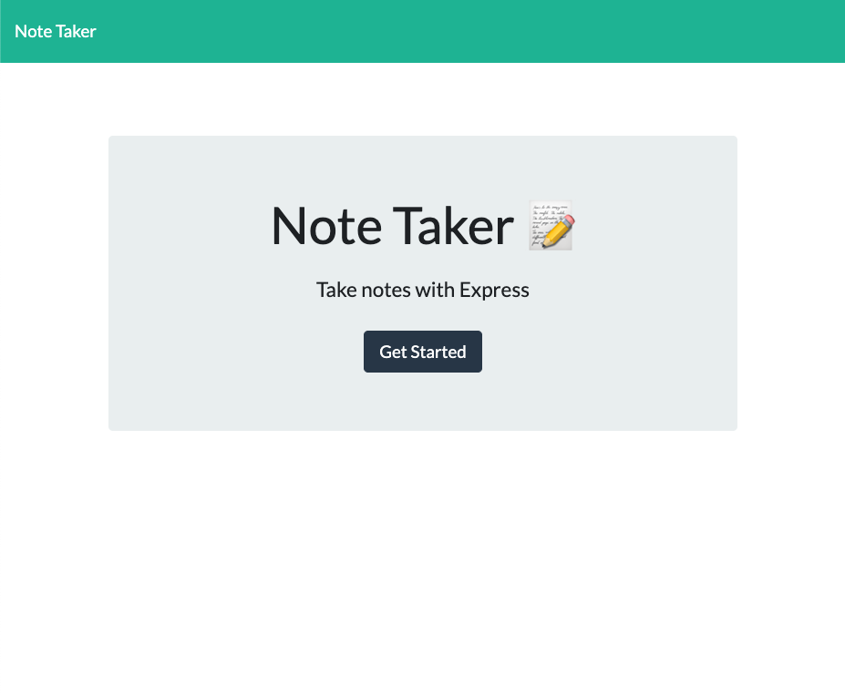
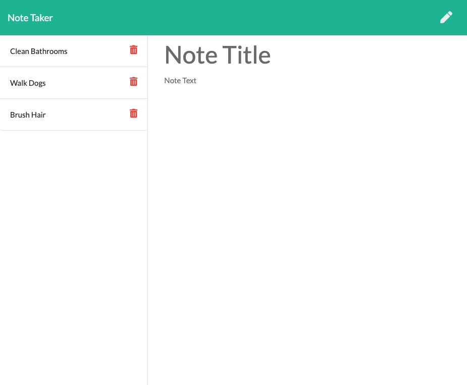

# express-note-taker-hw

# TITLE
Express Note Taker HW Assignment

# DESCRIPTION
Create an application that can be used to write, save, and delete notes. This application will use an express backend and save and retrieve note data from a JSON file. The application frontend has already been created, it's your job to build the backend and connect the two. Application should allow users to create and save notes. Application should allow users to view previously saved notes. Application should allow users to delete previously saved notes.

# SCREENSHOTS

# TECHNOLOGY
Node.js, Javascript, Express, Heroku

# FUTURE DEVELOPMENT

In future developments it would be great to add a multi-client functionality so that couples, families, or student groups could all view and edit the same notes application.

# SOURCES
I used class activities as references, and also worked with my Tutor on this assignment.